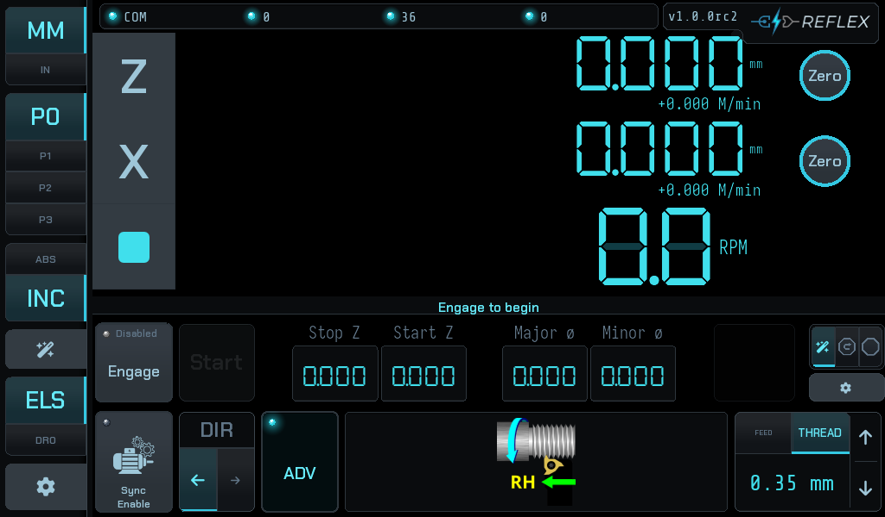
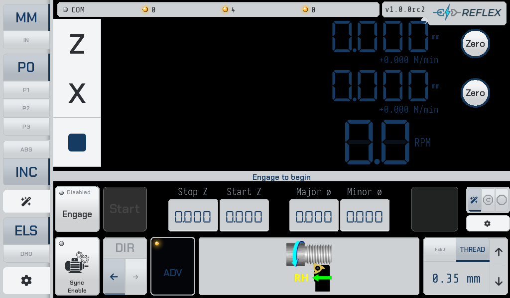

# Reflex UI

A **Kivy-based Digital Read-Out (DRO) and Electronic Leadscrew (ELS) controller UI** for lathes, designed to run on Raspberry Pi or desktop environments (Windows, macOS, Linux). Interfaces via RS-485/Modbus RTU with a dedicated STM32-based control board running the associated [Reflex firmware](https://github.com/Funkenjaeger/reflex-fw)

This software is based on the [rotary-controller-python (RCP)](https://github.com/bartei/rotary-controller-python) project and as of the present version, remains compatible with the associated hardware.  
This project (along with the corresponding FW project) was hard forked from the original primarily due to natural divergence that followed from a focus on lathe use cases, where the original rotary-controller was designed for CNC-style rotary table use cases.

---

## 📸 Screenshots

Home screen in ELS (Electronic Lead Screw) mode with the advanced bar expanded. These images are
regenerated automatically by CI and committed with each release, so they always reflect the
current UI on this branch.

| Dark | Light |
|------|-------|
|  |  |

---

## 🚀 Features

* Responsive touch-capable UI built with **Kivy**
* Communicates over **RS-485 Modbus RTU** with an STM32 controller running [Reflex firmware](https://github.com/Funkenjaeger/reflex-fw)
* **Configurable axes** — add/remove axes, assign hardware scale inputs, apply transforms (identity, scaling, weighted sum, angle cos/sin)
* **Electronic Lead Screw (ELS)** mode for synchronized threading and power feed on manual lathes
  - Automatic electronic stop, usable when feeding or threading
  - Optional electronic retract
  - Automatic phase re-sync to thread pitch between passes (allows free use of half nut between threading passes)
* Customizable display: fonts, colors, digit formats (metric/imperial/angle)
* **Contextual help** — info button on every setting field with documentation and examples
* Works on Raspberry Pi 3/4/5, Windows, macOS, and Linux

---

## 🎯 Requirements

* **Hardware**

  * STM32-based controller board (with STM32 firmware from [reflex-fw](https://github.com/Funkenjaeger/reflex-fw))
    - Compatible with the rotary-controller board available from [Provvedo](https://www.provvedo.com) (no affiliation)
  * RS-485 interface (e.g. via Power Hat)
  * Raspberry Pi 3/4/5 for Pi deployments

* **Software**

  * Python 3.10+
  * [`uv`](https://docs.astral.sh/uv/) package manager

---

## ⚙️ Installation & Setup

### 1. Clone the Repository

```bash
git clone https://github.com/Funkenjaeger/reflex-ui.git
cd reflex-ui
```

### 2. Install `uv`

Install `uv` (Linux/macOS):

```bash
curl -LsSf https://astral.sh/uv/install.sh | sh
```

For Windows, see the [uv installation docs](https://docs.astral.sh/uv/getting-started/installation/).

### 3. Install Dependencies

```bash
uv sync
```

### 4. Run the App

```bash
uv run python -m reflex.main
```

### 5. Run Tests

```bash
uv run pytest
```

---

## 💻 Platform-specific Notes

### Windows/macOS/Linux

* Python >= 3.10
* Virtual environment managed automatically by `uv`
* Ensure your RS-485 adapter is accessible (check serial port permissions on Linux/macOS)
* On headless Linux (e.g. WSL), you may need environment variables and flags: `DISPLAY=:0 SDL_AUDIODRIVER=dummy KIVY_INPUT=mouse uv run python -m reflex.main --size=1024x600`

### Raspberry Pi & OSPI

* Install an SD card image from the [OSPI project](https://github.com/bartei/ospi)
* OSPI ships with RCP pre-installed in `/root/rotary-controller-python/`. Reflex UI **must** be manually installed to replace it:

  ```bash
  # Stop the existing RCP service
  sudo systemctl stop rotary-controller

  # Clone reflex-ui
  cd /root
  git clone https://github.com/Funkenjaeger/reflex-ui.git
  cd reflex-ui
  uv sync

  # Update the systemd service unit to point to the new path and module
  ```

* View logs:

  ```bash
  journalctl -u reflex
  journalctl -xeu reflex
  tail -n +1 /var/log/kivy*
  ```

---

## 📂 Project Structure

```
reflex/
├── main.py                    # Entry point (asyncio + Kivy event loop)
├── app.py                     # MainApp class
├── feeds.py                   # Feed/thread pitch configurations
├── help/                      # Contextual help documents (markdown)
├── fonts/                     # Font files
├── pictures/                  # Image assets
├── sounds/                    # Audio assets (beep, snap, stop)
├── components/                # UI layer
│   ├── manager.py             # ScreenManager (navigation)
│   ├── appsettings.py         # ConfigParser setup
│   ├── home/                  # Home screen (coordbar, servobar, elsbar, jogbar, statusbar, mode layouts)
│   ├── screens/               # Full-screen views (home, setup, scale, servo, formats, axes, ELS, etc.)
│   ├── widgets/               # Reusable form widgets (number_item, boolean_item, dropdown_item, etc.)
│   ├── popups/                # Modal dialogs (keypad, help, feeds table, mode, etc.)
│   ├── toolbars/              # Toolbar buttons (led_button, toolbar_button, etc.)
│   ├── plot/                  # Plot/visualization (scene, popups, overlays)
│   └── setup/                 # Setup panels (logs, profiling)
├── dispatchers/               # Event dispatchers and state management
│   ├── saving_dispatcher.py   # Auto-persisting properties to YAML
│   ├── formats.py             # Display format settings
│   ├── circle_pattern.py      # Circle pattern calculator
│   ├── line_pattern.py        # Line pattern calculator
│   ├── rect_pattern.py        # Rectangle pattern calculator
│   ├── axis.py                # Axis configuration
│   ├── axis_transform.py      # Axis transform settings
│   ├── els.py                 # ELS configuration
│   ├── input.py               # Input configuration
│   ├── servo.py               # Servo configuration
│   └── board.py               # Board/device event dispatcher
├── fsms/                      # State machines
│   ├── els_fsm.py             # ELS state machine
│   ├── els_stop_hal.py        # ELS stop hardware abstraction
│   ├── fsm_event_bus.py       # Event bus for FSM communication
│   ├── ui_controller.py       # UI controller (mediates UI and FSM)
│   └── ui_fsm.py              # UI state machine
└── utils/                     # Hardware communication layer
    ├── communication.py       # ConnectionManager (Modbus RTU)
    ├── base_device.py         # C typedef parser and register I/O
    ├── devices.py             # Device type definitions
    ├── ctype_calc.py          # C-type arithmetic helpers
    ├── kv_loader.py           # KV file loading utility
    └── platform.py            # Platform detection utilities
```

---

## 🛠️ Troubleshooting

* **Serial issues**: Verify RS-485 wiring, correct serial port, and permissions
* **Service failures (Pi)**: Check `journalctl` logs and Kivy log files under `/var/log/`
* **Display issues**: Adjust font size and display format in the Formats setup screen

---

## 📚 References & Related Projects

* **Firmware:** [reflex-fw](https://github.com/Funkenjaeger/reflex-fw)
* **Compatible PCB:** [rotary-controller-pcb](https://github.com/bartei/rotary-controller-pcb)
* **OSPI OS:** [ospi](https://github.com/bartei/ospi) — ships with RCP pre-installed; see deployment notes below for replacing it with Reflex UI

### Internal docs

* **FSM architecture pattern:** [`kivy-fsm-design-pattern.md`](kivy-fsm-design-pattern.md)
* **ELS shoulder-stop orchestration:** [`ELS_STOP.md`](ELS_STOP.md)

---

## 🤝 Contributing

Contributions are welcome! Please:

* Open issues for bugs or feature requests
* Submit pull requests or improvements
* Help with testing, documentation, porting new features

---

## 📄 License

Licensed under MIT. See `LICENSE` for full terms.